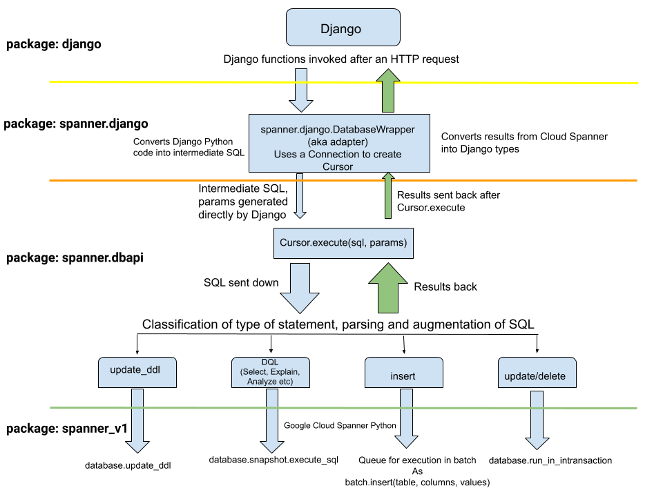

# django-spanner
ORM plugin for using Cloud Spanner as a database for Django.

## Table of contents
- [Installing it](#installing-it)
- [Using it](#using-it)
    - [Format](#format)
    - [Example](#example)
- [Running tests](#running-tests)
    - [Functional tests](#functional-tests)
    - [Django integration tests](#django-integration-tests)
- [Limitations](#limitations)
- [How it works](#how-it-works)
    - [Overall design](#overall-design)
    - [Internals](#internals)


## Installing it
```shell
pip3 install --user .
```

## Using it
After [installing it](#installing-it), you'll need to edit your Django `settings.py` file
and particularly the `DATABASES` section to point to an EXISTING database, of the format:

### Format

```python
DATABASES = {
    'default': {
        'ENGINE': 'spanner.django',
        'PROJECT': '<project_id>',
        'INSTANCE': '<instance_id>',
        'NAME': '<database_name>',
        # Only include this if you need to specify where to retrieve the
        # service account JSON for the credentials to connect to Cloud Spanner.
        'OPTIONS': {
            'credentials_uri': '<credentials_uri>',
        },
    },
}
```

### Example
For example:

```python
DATABASES = {
    'default': {
        'ENGINE': 'spanner.django',
        'PROJECT': 'appdev-soda-spanner-staging', # Or the GCP project-id
        'INSTANCE': 'django-dev1', # Or the Cloud Spanner instance
        'DATABASE': 'db1', # Or the Cloud Spanner database to use
    }
}
```

## Running tests

### Functional tests
We have functional tests for individual components that can be run by
```shell
tox
```

### Django integration tests
We run full integration tests with Django's test suite, on Travis Continuous Integration before every
pull request is merged. Please see the file [.travis.yml](./.travis.yml)

## Limitations

Limitation|Comment|Resolution
---|---|---
Lack of DEFAULT for columns|Cloud Spanner doesn't support using DEFAULT for columns thus the use of default values might have to enforced in your controller logic|
Lack of FOREIGN KEY constraints|Cloud Spanner doesn't support foreign key constraints thus they have to be defined in code
Lack of sequential and auto-assigned IDs|Cloud Spanner doesn't autogenerate IDs and this integration instead creates UUID4 to avoid [hotspotting](https://cloud.google.com/spanner/docs/schema-design#uuid_primary_key) so you SHOULD NOT rely on IDs being sorted|We generate UUID4s for each AutoField
Numeric values are saved as FLOAT64|Cloud Spanner doesn't support the NUMERIC type thus we might have precision losses|Decimal and Numeric are translated to FLOAT64. If Cloud Spanner adds NUMERIC in the future, you might need to migrate your columns
Optimistic transactions when running DDL and other statements|Cloud Spanner CANNOT run DDL (CREATE, DROP, ALTER) in a Transaction and CAN ONLY run them in the [DatabaseAdmin RPC]() so any mixes of DDL and other statements will make prior statements get run, DDL run, then following statements run separately|
107 unexplored Django tests|We need to run every single test in the Django test suite for 100% certainty|Currently in progress to complete the [211 test cases](https://gist.github.com/odeke-em/d3476b6cb7c3485de6aa29956ed50a75#file-all_tests-txt)
Table names CANNOT have spaces within them whether back-ticked or not|Cloud Spanner DOEST NOT support tables with spaces in them for example `Entity ID`|Ensure that your table names don't have spaces within them
Table names CANNOT have punctuation marks and MUST contain valid UTF-8|Cloud Spanner DOEST NOT support punctuation marks e.g. periods ".", question marks "?" in table names|Ensure that your table names don't have punctuation marks
Lack of stored procedures and triggers|Cloud Spanner DOES NOT support stored procedures nor triggers so if your code relies on them, you might need to move the logic into your application|Not supported
Lack of VARIANCE, STDDEV database functions|Cloud Spanned doesn't yet implement these functions|


## How it works

### Overall design


### Internals

